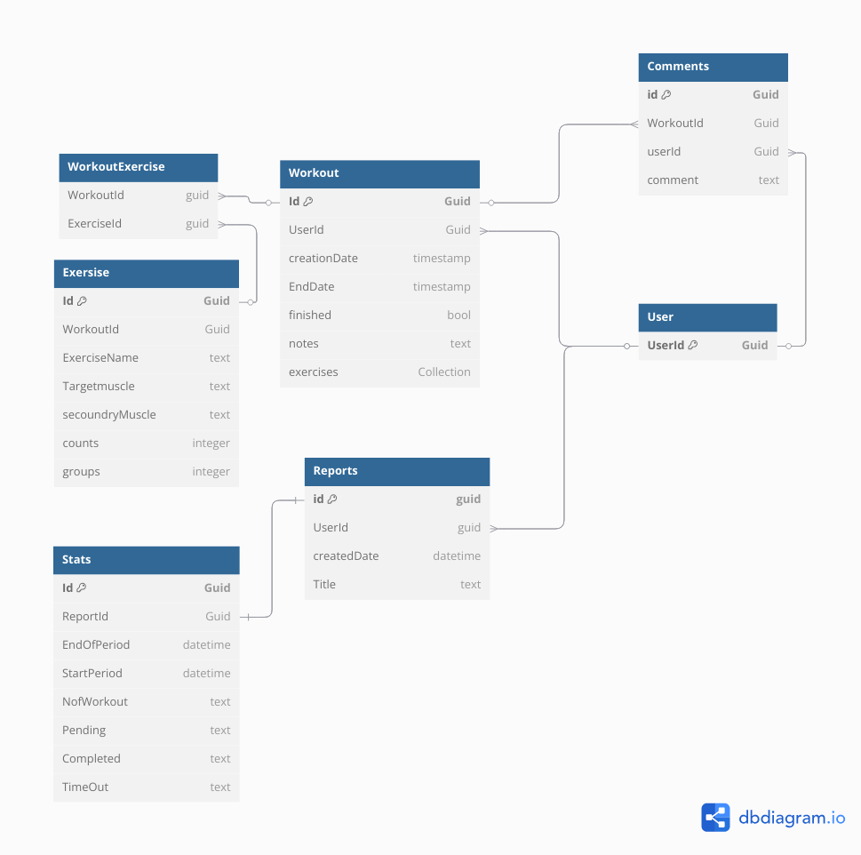

# Fitness Tracker System

## Design
This project is a **backend API built with .NET 8**, designed to support a fitness tracking application. It follows a **microservices architecture** where each service is responsible for a specific functionality while sharing a **single database** for centralized data management. The system is designed to be **extensible**, allowing for future updates, including new features and a frontend application.

## System Design

Below is the system design diagram illustrating the architecture of the fitness tracker application:

### System Components:
- **Gateway Service**: Handles incoming requests and routes them to the appropriate services.
- **Identity Service**: Manages user authentication and authorization.
- **Reporting Service**: Generates and retrieves user reports.
- **Workout Service**: Handles workout-related operations.
- **Database**: Stores all application data, including users, workouts, reports, and comments.

This system design ensures scalability, security, and efficient data handling for the fitness tracking application.

## Database Design

Below is the database diagram illustrating the relationships and structure of the database:

### Key Entities:
- **User**: Stores user information.
- **Workout**: Tracks workout sessions, including creation date, end date, and associated exercises.
- **Events**: Represents individual exercises within a workout, including target muscles and repetition counts.
- **Reports**: Provides progress reports for users over a specific period.
- **Comments**: Allows users to add comments to workouts.

This database schema ensures efficient management of fitness data while supporting the application's microservices architecture.

---

The project idea is a practice idea from the roadmap.sh article. You can find the article and more project ideas here: [roadmap.sh/backend/project-ideas](https://roadmap.sh/backend/project-ideas).
